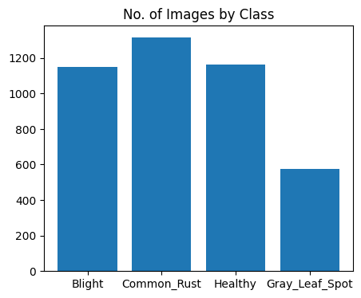
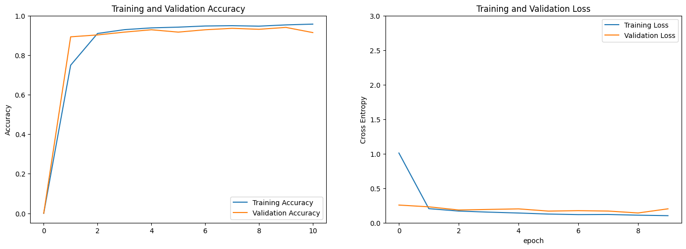

# Identifying Diseases in Corn Plant Leaves from Images: With 94% Accuracy

By: Sonali Agrawal

## Objective

The aim of this project is to identify whether corn plants are healthy or diseased by analyzing images of their leaves. We have built a Convolutional Neural Network (CNN) model to achieve our aim. CNN is a powerful type of deep neural network that extracts features from images to perform tasks like image classification. Our model has been trained using a dataset of categorized corn leaf images, including Healthy, Common Rust, Gray Leaf Spot, and Blight.

Given that the US is the world's largest producer, consumer, and exporter of corn, with approximately 90 million acres planted each year, it is crucial to monitor corn fields for signs of disease. Corn is the primary feed grain in the U.S., accounting for over 95% of total feed grain production and use, according to the [US Department of Agriculture](https://www.ers.usda.gov/topics/crops/corn-and-other-feed-grains/feed-grains-sector-at-a-glance/).

Our model enables corn farmers to effectively monitor their fields and detect disease symptoms as soon as they appear on plant leaves. By promptly identifying issues, farmers can take appropriate measures to address them. This technology provides a valuable tool for minimizing crop losses, improving productivity, and optimizing resources.

In summary, our CNN model empowers corn farmers to monitor their fields and swiftly detect disease symptoms on corn leaves. This enables timely interventions and appropriate actions to protect and maintain healthy corn crops.

## Data Access

We have downloaded the image dataset from [Kaggle](https://www.kaggle.com/datasets/smaranjitghose/corn-or-maize-leaf-disease-dataset). The dataset has total 4188 corn plant leaf images:

- Common Rust - 1306 images
- Gray Leaf Spot - 574 images
- Blight - 1146 images
- Healthy - 1162 images

*Figure 1: Number of Images by Class - Blight, Common Rust, Healthy and Gray Leaf Spot*  
  

## Analysis

We utilized the InceptionV3 model, which is pre-trained on the ImageNet dataset, as a starting point for building our CNN model. By leveraging pre-trained weights, the model learned valuable features from ImageNet's extensive collection of labeled images.

To tailor the InceptionV3 model to our specific task, we excluded the fully connected layers and utilized only the convolutional base. This base, along with our custom classifier, formed the foundation of our model. We froze the first 291 layers, making them non-trainable, while allowing the remaining layers to be fine-tuned.

To enhance the model's ability to generalize, we applied data augmentation techniques, increasing the diversity of our input images. The augmented data was preprocessed using the 'preprocess_input' function, ensuring compatibility with the InceptionV3 model's requirements.

To mitigate overfitting, we incorporated a dropout layer with a dropout rate of 0.2, providing regularization during training. Additionally, we added a fully connected dense layer with 4 units and a softmax activation function to serve as the final prediction layer, generating class probabilities for each input sample.

For training, we compiled the model using the Nadam optimizer with a base learning rate of 0.001 and trained it for 10 epochs. To address the issue of imbalanced data representation, we assigned different weights to each class, allowing the model to prioritize under-represented classes during training.

## Conclusion

The model exhibited excellent performance, achieving an accuracy rate of approximately 94% on the validation dataset.

*Figure 2: Training and Validation Accuracy Plot of the CNN Model*  
  
